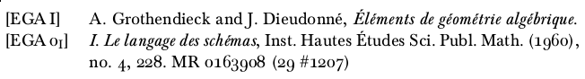

bibtex-dual
-----------

Ever wanted to have two labels/keys with a single entry in your BibTeX
bibliography? Now you can! I have implemented a working example using the
'amsalpha' BibTeX style. The result looks like this:

Multiple things are going on here:

1. hyperlinks generated by the hyperref \cite command continue to work. this
   work is done by the stuff in bibtex-dual.tex.
2. custom labels sort correctly by modifying FUNCTION calc.label in
   amsalpha-dual.bst.
3. a new bibtex entry 'articledual' is added to amsalpha-dual.bst. this allows
   for the extra LABEL2 and KEY2 options.
4. accordingly, articledual calls a new FUNCTION output.bibitemdual, which in
   turn calls \bibitemd defined in bibtex-dual.tex.

The most confusing part is probably the .bst file, which is written in reverse Polish notation. The reference I used was Nicolas Markey's '[Tame the BeaST](https://www.ctan.org/tex-archive/info/bibtex/tamethebeast)' document.
